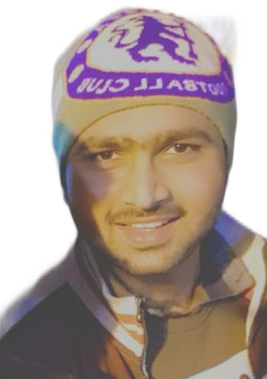

[//]: # (This is how a comment is added in markdown.)

Hi, you have reached usama sadiq's personal webpage.\
Caution! Page is under construction.

## About Me

[//]: # (Edit this for customizing the profile-picture.)
[//]: # (Other settings of image are profile-pictur class in typography.css file.)

 

Hi! I am Usama Sadiq. I am associate researcher at [Vision Processing Lab](http://vispro.itu.edu.pk/) at Informtation Technology University [ITU](https://itu.edu.pk/), Lahore.
This is my personal webpage where I like to share about my research work, projects and other interesting stuff that I like to do and share with others.

## Research Interest

Generally, I am interested in mathematics and programming. Specifically, my research interest includes Machine Learning, Deep Learning especiallly deep learning on geometric or non-euclidean data spaces and Computer Vision Geometry. I have also worked on 3D image reconstruction and image matching during my MS research work.  

## News about my Blog Posts

I will update about my most recent blog posts here.

## Publications

1. Usama S. ............................................................
2. Usama S. ............................................................
3. Usama S. ............................................................

## Projects
1. Proect-1.............................................................
2. Proect-2.............................................................
3. Proect-3.............................................................

## Awards & Honors

[//]: # (This is a [link](http://google.com). Something *italics* and something **bold**.)

Year | Award | Category
-----|-------|--------
2018 | Graduate Fellowship  | Secured Graduate Student Fellowship in MS Electrical Engineering at [ITU](https://itu.edu.pk/)
2017 | Graduate Assistantship | Secured Graduate Assistantship in MS APPLIED MATHEMATICS at [GIKI](https://www.giki.edu.pk/)

## This is my favorite quote!
> All models are wrong, but some are useful.
                            George E.P. Box
                            
                            
## Associations:
1. ...............................................
2. ...............................................

## References

* Reference # 1: ...................................................
* Reference # 2: ...................................................
* Reference # 3: ...................................................
